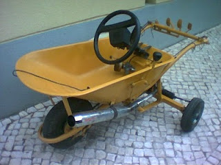

```{r setup, include=FALSE, echo=FALSE}
knitr::opts_chunk$set(echo = FALSE)
if (!require("DT")) install.packages('DT')
library(DT)

if (!require("formattable")) install.packages("formattable")
library(formattable)
```

----  

<h2>R-Markdown: Slidy Html</h2>

<h2>Dicas: Modos de exibição</h2>

Os seguintes caracteres simples habilitam modos de exibição alternativos:

'C' exibir índice  
'F' Alterna a exibição do rodapé  
'A' Alterna a exibição do slide corrente vs todos os slides (útil para impressão de páginas)  
'S' diminuir fontes  
'B' aumentar fontes  


# PILARES. Exercício

1) Dimensionar um pilar para sustentar uma massa de 8400 kg a uma altura de 3,80m. Utilizar $F_{ck} = 130 \ kg/cm^2$ e o aço CA-32. Determinar as quantidades necessárias dos componentes do concreto para a construção de 16 pilares, usando o traço 1:2,5:4.

----  

# 1. Cálculo das resistências

. Valor de resistência do aço CA-32, conforme a tabela xx: $F'_{yd} = 2783 kg/cm^2$

. Resistência de cálculo do concreto:
$$F_{cd} = \frac{F_{ck}}{\lambda_c} = \frac{130 kg/cm^2}{1,4} = 92,86 kg/cm^2$$

. Cálculo da Carga (Peso x Fator de segurança): 
$$P_d = Massa * 1,4 = 8400 kg/cm^2 * 1,4 = 11760 kg$$ 

----  

# 2. Seção de Concreto Teoricamente Necessário:
$$A_{c1} = \frac{1,2 . P_d}{0,85.F_{cd} + l . F'_{yd}} = \frac{1,2 * 11760}{0,85*92,86 + 0,008*2783} = \frac{14112}{101,20} = 139,45 cm^2$$
Sendo:

- $A_{c1}$: Seção de concreto teoricamente necessário;<BR>
- $P_d$: Carga suportada;
- $F_{cd}$: resistência de cálculo do concreto;
- $l$: percentual mínimo da seção transversal de ferro na armadura (0,8% a 6%);
- $F'_{cd}$: resistência de cálculo do aço.


----  

# 3. Lado do Pilar

$$b = \sqrt{A_{c1}} = \sqrt{139,45} = 11,81 cm$$
. Para que não haja Flambagem, a esbeltez deve ser menor que 40. Calcular usando a equação do Grau de Esbeltez: 

$$\lambda = \frac{3,46* L_{fl}}{b} \le 40$$ 

$\lambda = \frac{3,46* 380 cm}{11,81} = 111,32 cm$ $\__>$ Não ok, pois é maior que 40.

 . Calculando o lado a partir do maior valor de Flambagem:
$$b = \frac{3,46* L_{fl}}{\lambda} = \frac{3,46* 380cm}{40} = 32,87 cm$$
Corrigindo a seção do concreto: $A_{cl(corrigido)} = b^2 = (32,87)^2 = 1080 cm^2$  

---- 

# 4. Cálculo da Seção do Aço:   
Se $A_{cl(corrigido)} > A_{cl(teórico)}$ então:  
$$A_s = l*A_{c1} = 0,8\%*1080cm^2 = 0,008 * 1080 = 8,64 cm^2$$  
. Em geral são utilizadas 4 barras de ferro para a armadura. Segundo a tabela XX, o diâmetro da barra de ferro CA-32 onde $A_s = 8,64 cm^2$ corresponde a 19,05 mm. 

. Cálculo do diâmetro dos **Estribos**:  
$$e = \frac{1}{4}* A_S = \frac{19,05}{4} = 4,76 mm$$  


----  

# 5. Volume do Pilar  

$$V = b_1 * b_2 * L = (0,3287 m)^2 * 3,80m = 0,41 m^3$$  

Onde:  
. V: volume do pilar ($m^3$);  
. $b_1, b_2$: lados do pilar (m);  
. L: altura do pilar (m)   


# 6. Quantidade dos materiais   
Com base nos parâmetros do traço, calcular o peso de $1 m^3$ de cimento conforme a equação abaixo:  

$$P_c = \frac{2400}{0,856+(1,014*a)+(0,835*b)+(2,65*R_{a/c})}$$ 
$$P_c = \frac{2400}{0,856+(1,014*2,5)+(0,835*4)+(2,65*0,5)} = \frac{2400}{8,056} = 297,91 kg$$  


Onde:  
. $P_c$: peso de $1,0 m^3$ de cimento;  
. a: partes de areia (aglomerado miúdo);  
. b: partes de brita (aglomerado graúdo);  
. $R_{a/c}$: relação água/cimento (mínimo 0,48, máximo 0,70). No exercício foi definido como 0,5.  

## Quantidade de sacos de cimento por $m^3$  
$$Sc = \frac{P_c}{50 kg} = \frac{297,91 kg}{50 kg} = 5,96 sacos$$


## Volume de areia  
$$A = \frac{P_c*1,014*a}{1,42} = \frac{297,91*1,014*2,5}{1,42} = \frac{755,20}{1,42} = 531,83 Litros$$


## Volume de brita  
$$B = \frac{P_c * 0,835 * b}{1,42}= \frac{297,91 * 0,835 * 4}{1,42} = \frac{995,02}{1,42}=700,72 Litros$$

## Volume de Água  
$$Agua = P_c * R_{a/c} = 297,91 * 0,5 = 148,96 Litros$$ 


<!-- $ $ -->
<!-- \begin{array} -->
<!-- {lccl} -->
<!-- Material & Volume \ (1,0m^3) & Cada \ pilar & Para \ 16 \ pilares \\ -->
<!-- Cimento  & 297,71 kg         & 122,14 kg  & 1954,29 kg = 39,10 \ sacos \ cimento \\ -->
<!-- Areia    & 531,83 L          & 218,10 L   & 3488,80 L = 1 \ caçamba \ de \ 4,0m^3 \\ -->
<!-- Brita    & 700,72 L          & 287,30 L   & 4596,72 L = 1 \  caçamba \ de \ 5,0 m^3\\ -->
<!-- Água     & 148,96 L          & 61,07 L    & 977,12 L   -->
<!-- \end{array} -->
<!-- $ $ -->

```{r echo=FALSE, results='asis'}
library(knitr)
m <- data.frame(
                material = c("Cimento (kg)","Areia (Litros)","Brita (Litros)","Água (Litros)") ,
                traco = c(1, 2.5, 4, 0.5), 
                volume = c(297.71, 531.83, 700.72, 148.96),
                cadapilar= c(122.14, 218.10, 287.30, 61.07), 
                todos = as.double(c(1954.24, 3488.80, 4596.80, 977.12 ))
                ) 
# Descrição das colunas
names(m) <- c("Material", "Traço", "Volume (1 m³)", "Cada Pilar", "Para 16 pilares")
#m
datatable(m, autoHideNavigation = TRUE, selection = single,
          caption = htmltools::tags$caption(
            style = 'text-align: left;','Tabela 1: Quantidade de Materiais') )

# kable(m, caption = "Tabela 1: Quantidade de Materiais", format = "html" )

# formattable(m, caption = "Tabela 1: Quantidade de Materiais", list(style="border-top: 5px") )
```


----  

<center><h1>Obrigado!!!</h1></center>

```{r fig.align='center', fig.width=500}

```

**Bibliografia:**

- Apostila da disciplina.

**Ferramenta de edição:**  

- RStudio IDE. Version 1.0.153 – © 2009-2017 RStudio, Inc. 
- R-Markdown. Apresentação no formato "Slidy Html". 
